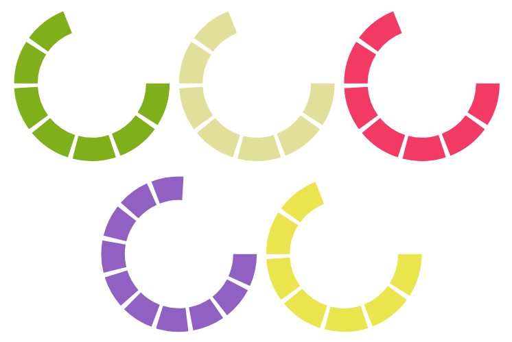

# Tzolkin



```
clojure -m figwheel.main -b dev -r
```

### Goal 1
 - all non-expansion game functionality
 - navigatable move history
 - create public boards (private URLs)
 - no sign in required, any user can play any move

### Goal 2
 - users can login
 - create public/private boards, adjust settings like max/min players
 - boards can be joined, closed, spectated
 - custom svg icons (instead of emojis)
 - actions/temples/tech can be directly clicked to make decisions
 - better round indicator (details about food days etc.)
 - wheels spin at end of turn

### Goal 3+
 - expansions
 - juicy animations
